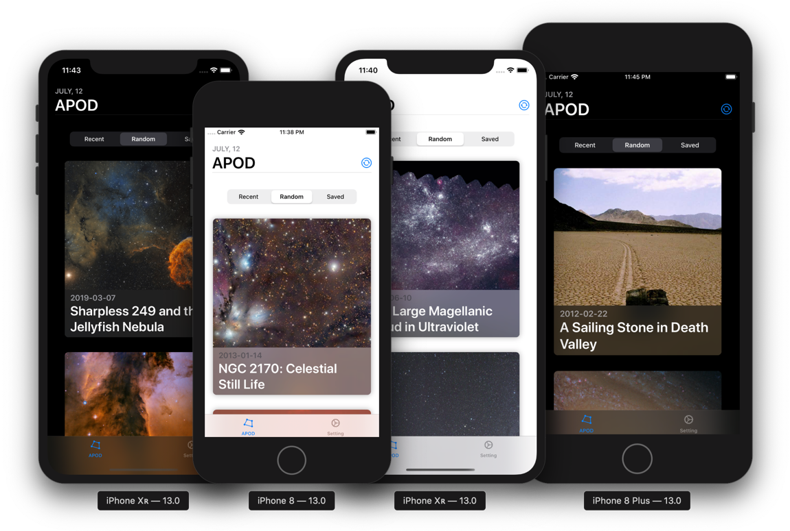

# SwiftUI-APOD

An example Astronomy Picture of the Day(APOD) application using SwiftUI and Combine under iOS 13

## Requirement

* Xcode 11
* macOS 10.15 Catalina
* iOS 13

Please build with Xcode 11 and macOS 10.15 Catalina

## Getting Started

* Please reference [nasa/apod-api](https://github.com/nasa/apod-api) for api-usage
* Put your API Key into *Models/UserData.swift*

## Bug

* Saved is unavaliable
* URLSession Publisher handle